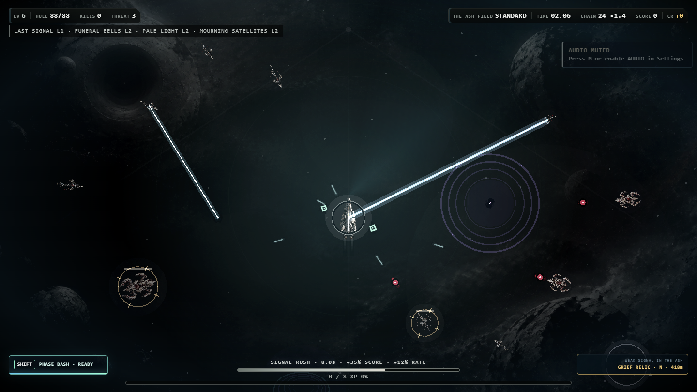

# ORBIT//04

[](https://github.com/waldmare/Orbit-04/actions/workflows/ci.yml)


ORBIT//04 is a single-player, top-down space survival game. Weapons fire automatically while the player controls movement, positioning, and a short-range dash. A standard run lasts 12 minutes and ends with a third boss encounter.

Current version: `0.67.0`

## Runtime overview

| Component | Implementation |
|---|---|
| Rendering | Phaser 3.90, WebGL with Canvas fallback |
| Internal resolution | 1440 × 810 |
| Desktop host | Electron 43 |
| Game logic | JavaScript running locally in the renderer process |
| Save data | Browser `localStorage` with automatic backup, manual export, and import |
| Automated checks | Node.js tests and Windows packaging on GitHub Actions |

The supported runtime is the top-down Phaser implementation loaded by `index.html`. The repository also contains an inactive third-person prototype; it is not imported by the current game.

## Implemented game systems

- 10 selectable frames with individual base statistics, starting weapons, and traits
- 11 automatic weapon systems with upgrades and evolutions
- 3 difficulty levels, 4 sectors, and 4 optional run contracts
- boss encounters at approximately 3:30, 7:30, and 12:00
- optional Ascension mode after completing the base run
- persistent credits, research upgrades, frame mastery, operations, achievements, and Codex data
- projectile grazing, kill chains, Signal Rush, Overdrive, caches, anomalies, and hostile conversion
- continuous directional travel with camera-safe world scrolling and active-encounter preservation
- deterministic space generation beyond the starting view, including asteroid fields, wreckage, ion formations, and void sites
- five exploration signals: repair, combat amplification, salvage, risk/reward relics, and hostile jammers
- live Run Intel for weapon contribution, modules, links, doctrines, protocols, artifacts, and mission conditions
- keyboard, mouse, and gamepad movement
- licensed sample playback with automatic context recovery, verified-playback status, mute warnings, and an in-game output check
- local save export, import, and reset controls

Detailed balance targets are documented in [BALANCE.md](BALANCE.md). Historical changes are recorded in [CHANGELOG.md](CHANGELOG.md).

## Rendering implementation

The Phaser scene loads the active backgrounds, ship sprites, and audio files from local paths. `visual-engine.js` manages retained object pools for ships, projectiles, pickups, particles, orbiting weapons, and damage text. Energy beams, arcs, rifts, telegraphs, and additive lighting use separate graphics layers.

The renderer includes:

- distinct sprites for the player, six standard enemy classes, and the boss
- aspect-ratio-preserving sprite scaling
- matte-free ship textures selected for the active camera scale
- vector glow, engine trails, elite markers, and telegraphs drawn in a dedicated additive pass
- configurable particles, background detail, contrast, and graphics quality
- four runtime background states: deep space, pulsar, gravitational rift, and supernova
- a vector rendering fallback when the retained sprite engine is unavailable

## Runtime screenshot



This 1440 × 810 image is an automated capture from the active Electron/WebGL runtime. The capture uses the real HUD, Phaser renderer, background system, ship textures, enemy classes, and gameplay state. Enemy placement and run time are fixed only to make the result reproducible; it is not concept art or a UI mockup.

## Audio implementation

Gameplay sound effects use selected files from Kenney's Sci-Fi Sounds package. Music uses three Mixkit tracks assigned to exploration, combat, and boss states. The runtime crossfades between those states and applies separate sound-effect and music volume controls.

License and source information is listed in [THIRD_PARTY.md](THIRD_PARTY.md).

## Display and accessibility settings

The settings screen provides:

- player and enemy health display modes
- numeric or percentage XP display
- critical-only, all, or disabled damage numbers
- optional attack telegraphs and pilot hints
- `HOLD`, `FOLLOW`, and disabled mouse steering modes
- screen shake and flash toggles
- full and reduced motion modes
- three interface scales
- particle, graphics, glow, background, and contrast controls
- three dynamic-range profiles with independent music and sound-effect volume
- curated Readability, Cinematic, Performance, and Defaults profiles with individually editable controls

## Requirements

- Node.js 22 or 24 LTS (Node 22 is used by CI)
- npm
- Windows 10 or 11, 64-bit, for the release package

## Install and run

### Windows launcher

Double-click `START_ORBIT.cmd`. The launcher installs missing dependencies and starts Electron.

### Windows terminal

```bat
npm.cmd install
npm.cmd start
```

Using `npm.cmd` avoids the PowerShell `npm.ps1` execution-policy restriction without changing the system execution policy.

### macOS or Linux terminal

```bash
npm install
npm start
```

The install step runs `postinstall`, which copies the pinned Phaser runtime to `vendor/phaser.min.js`. Opening `index.html` directly from the filesystem is not the supported launch path.

## Controls

| Input | Action |
|---|---|
| `WASD` or arrow keys | Move |
| Hold left mouse button | Steer toward the cursor in `HOLD` mode |
| Mouse position | Steer toward the cursor in `FOLLOW` mode |
| Left stick or D-pad | Move with a gamepad |
| `Shift` | Phase Dash |
| `P` or `Esc` | Pause or resume |
| `Tab` or `B` | Open or close Run Intel during a run |
| `M` | Toggle audio |
| `F` | Toggle fullscreen |
| `R` | Restart after a completed or failed run |

Weapons fire automatically.

## Tests

Run the complete suite:

```bat
npm.cmd test
```

Run only the asset integrity audit:

```bat
npm.cmd run test:assets
```

Capture the documented gameplay scene from the local Electron/WebGL build:

```bat
npm.cmd run screenshot
```

The capture command writes `docs/runtime-screenshot.png` only after the renderer, gameplay state, HUD, and enemy scene pass runtime readiness checks.

The suite checks JavaScript syntax, core combat and progression behavior, boss timing, commercial systems, Ascension, renderer integration, runtime asset references, media file signatures, image dimensions, and the local Phaser bundle.

## Package the desktop application

```bat
npm.cmd run release:check
```

Electron Forge writes the validated Windows application to `out/ORBIT-04-win32-x64/`. Launch `ORBIT-04.exe` from that directory for the final local check. SteamPipe templates, store-capture commands, and the remaining Steamworks steps are documented in [STEAM_RELEASE.md](STEAM_RELEASE.md).

## Repository layout

```text
index.html                 Application shell and interface
game.js                    Game state, content, input, audio, and Phaser setup
visual-engine.js           Retained sprite pools and rendering layers
styles.css                 Interface and display settings
desktop/main.cjs           Electron main process
assets/                    Runtime images and audio
tests/                     Gameplay, renderer, and asset checks
tools/                     Asset build and Phaser vendoring scripts
.github/workflows/ci.yml   GitHub Actions test workflow
```

## Contributing

See [CONTRIBUTING.md](CONTRIBUTING.md) for setup, testing, asset licensing, and pull request requirements. Visual changes must use screenshots captured from the running game. Concept art and mockups must be labeled explicitly.

## Release status

Version 0.67.0 is a Windows release-preparation build with procedural exploration, continuous combat-field travel, verified audio playback diagnostics, corrected early encounter composition, and in-run build telemetry. The repository can generate and validate the offline desktop package and real 1920 × 1080 gameplay captures. A public Steam release still requires external playtesting, minimum-hardware performance validation, a Steamworks App ID and depot, final store capsules, Steam client installation testing, and Valve approval.

## License

The project source is publicly visible but proprietary. See [LICENSE.md](LICENSE.md). Third-party software and media retain their respective licenses as documented in [THIRD_PARTY.md](THIRD_PARTY.md).
