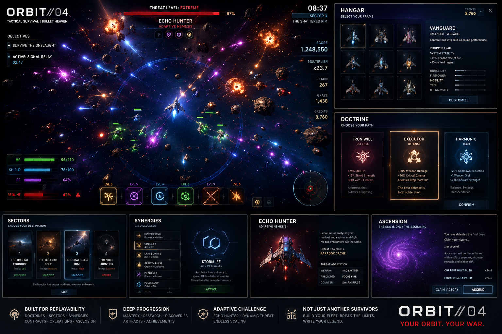

# ORBIT//04

[](https://github.com/waldmare/Orbit-04/actions/workflows/ci.yml)


Kosmiczny survival / bullet heaven z premium widokiem z góry.

**Aktualny build:** `0.63.0 — Premium Asset Edition`



## Szybki start

1. Pobierz lub sklonuj repozytorium.
2. W Windows uruchom `START_ORBIT.cmd`.
3. Przy pierwszym starcie launcher sam pobierze zależności i przygotuje lokalny Phaser.

Gra działa jako lokalna aplikacja Electron. Nie uruchamiaj `index.html` bezpośrednio z dysku.

## Technologie

| Warstwa | Rozwiązanie |
|---|---|
| Renderer | Phaser 3.90 / WebGL z Canvas fallback |
| Desktop | Electron 43 |
| Gameplay | JavaScript, bez zewnętrznego backendu |
| Audio | licencjonowane sample Kenney i Mixkit |
| Automatyzacja | GitHub Actions + testy Node.js |

## Silnik i prezentacja

- aktywny renderer Phaser 3.90 WebGL z widokiem z góry
- osiem nowych, pełnych modeli statków: gracz, sześć klas przeciwników i boss
- pooling setek przeciwników, pocisków, dropów i efektów
- warstwowe światło addytywne, smugi silników, cienie i uderzenia energii
- cztery animowane fazy kosmosu: deep space, pulsar, gravity rift i supernova
- kinowe przejścia tła, paralaksa i proceduralne zjawiska kosmiczne
- duży, skalowalny interfejs desktopowy z trybami LARGE / XL / XXL
- aplikacja Electron działająca całkowicie lokalnie

Eksperymentalny renderer trzecioosobowy nie jest ładowany i nie jest zależnością aktywnej gry.

## Luminous gameplay polish

- nowy Phase Dash na `Shift`: unik, krótka nietykalność i kasowanie bliskich pocisków
- czytelny cooldown dasha bezpośrednio w HUD
- smugi po statku, podwójna fala energetyczna i mocniejsza praca silników podczas dasha
- SIGNAL RUSH przyspiesza i powiększa przyciąganie XP, dzięki czemu nagroda jest natychmiast odczuwalna
- dopracowane reakcje interfejsu, wejścia paneli, komunikaty i luminancja sceny
- zachowane 10 statków, 11 broni, ewolucje, synergie, doktryny, kontrakty i Ascension

## Premium asset pass

- każdy typ przeciwnika ma teraz własną sylwetkę, materiał i kolorystykę zamiast jednego wielokrotnie barwionego modelu
- proporcje sprite'ów są zachowywane przez renderer; statki nie są już rozciągane do kwadratów
- wadliwe cienie będące czarnymi kopiami PNG zastąpiono miękkimi geometrycznymi cieniami
- aktywne SFX korzystają z 70-elementowego pakietu Kenney Sci-Fi Sounds CC0
- eksplozje, bossowie i broń ciężka mają dodatkową warstwę niskoczęstotliwościowego uderzenia
- proceduralną muzykę zastąpiły trzy pełne utwory Mixkit z adaptacyjnym przejściem eksploracja / walka / boss

## Studio QoL i readability

- osobny widget Phase Dash z paskiem gotowości
- szybki restart bez wychodzenia do hangaru oraz `R` po zakończeniu runu
- opcjonalne liczby obrażeń: tylko krytyki, wszystkie albo wyłączone
- telegraphy przed strzałami snajperów, gunnerów, bossów oraz szarżą chargera
- delikatna winieta REDLINE przy niskiej integralności kadłuba
- PILOT ASSIST z krótką podpowiedzią sterowania na początku runu
- tryb REDUCED MOTION ograniczający drgania, animacje UI i ruch tła
- profile dynamiki CINEMA, BALANCED i NIGHT
- oddzielne sample dla głównych broni, trafień, interfejsu i zdarzeń specjalnych
- trzy pełne utwory z adaptacyjnym miksem i automatycznym duckingiem przy uderzeniach

## Core systems

- 12-minute base runs + optional Ascension endgame
- 10 playable frames with unique traits and mastery
- 11 weapon systems, evolutions and Overcharge
- hidden weapon synergies
- Doctrines, Contracts and Volatile Protocols
- 4 sectors with different encounter modifiers
- Echo Hunter adaptive nemesis
- multi-phase bosses
- IFF hostile conversion / allied fleet builds
- Signal Windows, Anomalies and Secret Transmissions
- Data / Rare / Omega / Paradox caches
- chain, graze, REDLINE and OVERDRIVE systems
- persistent Research, Operations, achievements and Codex
- licensed sample-based combat pack and adaptive full-length soundtrack
- keyboard, mouse, gamepad and touch input

## 0.60 Resonance audio and space

- completely regenerated 14-piece combat SFX pack at 48 kHz stereo
- three synchronized music stems: exploration, combat and boss
- continuous crossfades driven by threat, REDLINE, SIGNAL RUSH and boss encounters
- cinematic sub-bass, filtered texture, mechanical transients and stereo room reflections
- four-stage background director: deep space, pulsar, gravitational rift and supernova
- 4.2-second cinematic crossfades, parallax drift and procedural celestial pulses
- boss encounters force the supernova scene without changing gameplay balance

## 0.50 Reforged presentation

- completely replaced immediate-mode combat shapes with a retained Phaser sprite renderer
- new high-detail player interceptor, hostile hunter and boss carrier artwork
- pooled enemies, projectiles, loot, particles, mines, drones and photon blades
- layered hull materials, shadows, additive engine plumes, reactor light and rank markers
- scalable boss presentation and readable sprite-based health bars
- energy arcs, beams and rifts composited in a dedicated additive FX layer
- animated hangar hero ship and cinematic vignette
- the former vector renderer remains only as a safe fallback

## 0.40 Vanguard presentation

- cinematic deep-space background loaded through Phaser
- forced WebGL, additive lighting, parallax and engine particles
- material shadows, hull panels, cockpit cores and animated thrusters
- camera shake integrated with Phaser cameras
- redesigned glass HUD, menus and buttons
- 15 layered 48 kHz stereo sound assets
- sample-based adaptive combat music replacing oscillator-first audio
- full LARGE / XL / XXL interface scaling and expanded graphics controls

## 0.30 visual pass

The original low-resolution pixel renderer was replaced with Phaser.

- smooth vector spacecraft and hostile silhouettes
- additive projectile and engine glow
- layered star field and sector fog
- modern 16:9 desktop HUD
- higher-resolution rendering
- differentiated elite, boss, rift, cache and weapon effects
- configurable FX quality
- no `image-rendering: pixelated`

The game keeps its restrained retro-futuristic identity without imitating a phone screen.

## Balance pass

`0.30.0` reduces health-sponge scaling and shifts difficulty toward movement, density and projectile pressure.

- slightly later first elite
- earlier first boss encounter
- lower boss HP, stronger later boss damage
- flatter early hostile hull growth
- sharper late-run density curve
- narrower power gap between defensive and glass-cannon frames
- smoother XP curve
- revive returns at 30% hull

See `BALANCE.md` for the design targets.

## Uruchomienie

Najprościej: kliknij dwukrotnie `START_ORBIT.cmd` w folderze gry. Przy pierwszym uruchomieniu plik sam doinstaluje brakujące składniki.

Alternatywnie w terminalu:

```bat
npm.cmd install
npm.cmd start
```

`npm.cmd` omija blokadę `npm.ps1` bez zmieniania polityki PowerShell. Nie otwieraj `index.html` bezpośrednio z dysku — pełny renderer WebGL i audio uruchamia aplikacja Electron.

Package:

```bat
npm.cmd run package
```

Electron Forge writes output to `out/`.

## Test

```bat
npm.cmd test
npm.cmd run test:assets
```

Testy sprawdzają progresję, walkę, bossów, IFF, synergie, Ascension, renderer oraz integralność wszystkich obrazów i plików audio używanych przez grę.

## Controls

- `WASD` / strzałki — ruch
- przytrzymany lewy przycisk myszy — sterowanie w stronę kursora
- `Shift` — Phase Dash
- `P` / `Esc` — pauza
- `M` — wyciszenie dźwięku
- `F` — pełny ekran
- `R` — szybki restart po zakończeniu runu
- lewy drążek / D-pad — sterowanie gamepadem

Weapons fire automatically.

## Status

Grywalny build premium z aktywnym silnikiem top-down Phaser. Eksperymentalny prototyp 3D pozostaje nieaktywny i nie jest ładowany przez grę.

Przed wersją 1.0 projekt nadal wymaga zewnętrznych playtestów, telemetrii balansu, testów wydajności late-game i pełnej walidacji paczki desktopowej.
