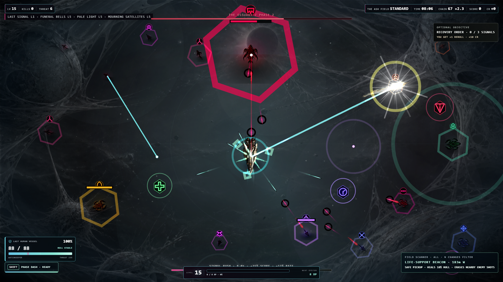
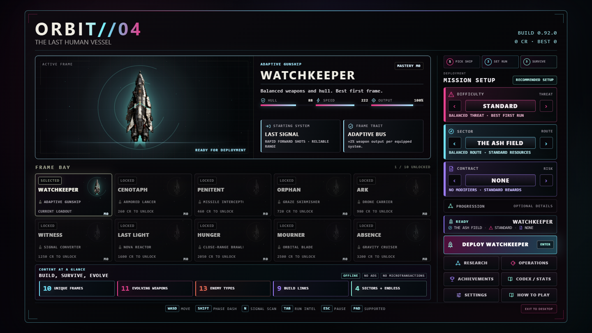
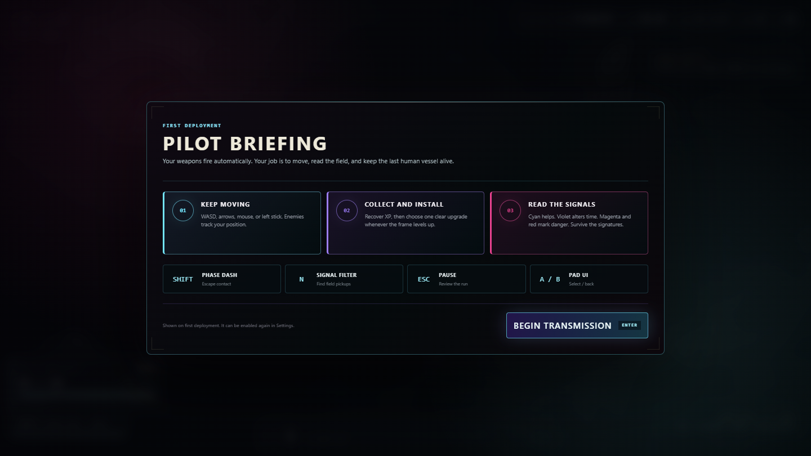
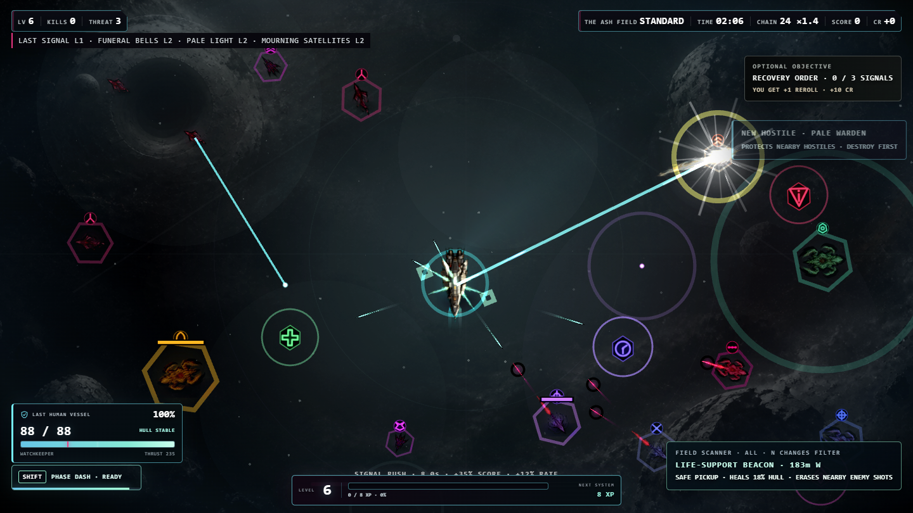
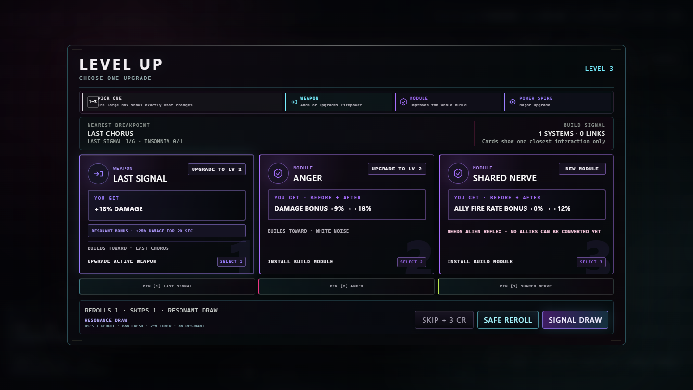
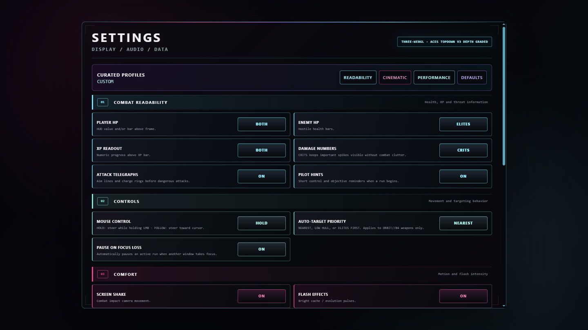

# ORBIT//04



**A 12-minute top-down survival run aboard humanity's last vessel.** Build an automatic arsenal, cross an alien-occupied universe, and survive the Conqueror.

[](https://github.com/waldmare/Orbit-04/actions/workflows/ci.yml)


ORBIT//04 is a single-player, top-down survival game about the last human-crewed vessel crossing a universe occupied by an alien organism. Weapons fire automatically while the player controls movement, positioning, and a short-range dash. A standard run lasts 12 minutes and ends with a confrontation against the Conqueror.

Current version: `0.92.0`

## Runtime overview

| Component | Implementation |
|---|---|
| Combat presentation | Three.js r185, WebGL, orthographic top-down camera, ACES tone mapping |
| Simulation and fallback host | Phaser 3.90 with Canvas fallback |
| Internal resolution | 1440 × 810 |
| Desktop host | Electron 43 |
| Game logic | JavaScript running locally in the renderer process |
| Save data | Browser `localStorage` with automatic backup, manual export, and import |
| Automated checks | Node.js tests and Windows packaging on GitHub Actions |

The supported runtime is the top-down game loaded by `index.html`. Three.js is the active combat presentation layer. Phaser continues to host the simulation-facing scene, local audio, animated environment, and compatibility fallback while the migration proceeds without discarding gameplay content or save compatibility. The repository also contains an inactive third-person prototype; it is not imported by the current game.

## Implemented game systems

- 10 configurations of the single ORBIT//04 ark, each with individual statistics, a starting weapon, and a trait
- a focused launch hangar using the deployed hull asset, an owned-frame filter, comparable ratings, and a separate credit purchase after previewing a locked frame
- a data-driven content overview in the launch hangar that states the shipped frame, weapon, hostile, synergy, and sector counts alongside the offline, advertising-free ownership model
- a one-screen first-deployment briefing that explains automatic fire, movement, upgrades, signal colors, keyboard controls, and standard gamepad controls without interrupting later runs
- 11 automatic weapon systems rethemed around grief, survival instinct, memory, and absence
- concise level-up cards that expose immediate impact and one nearest evolution or synergy without presenting the full build graph at once
- 3 difficulty levels, 4 sectors, and 4 optional run contracts
- boss encounters at approximately 3:30, 7:30, and 12:00
- optional Ascension mode after completing the base run
- persistent credits, research upgrades, frame mastery, operations, achievements, and Codex data
- projectile grazing, kill chains, Signal Rush, Overdrive, caches, anomalies, and hostile conversion
- authored 36-second encounter rhythms that alternate buildup, evolving contact formations, density surges, and short release windows with faster salvage attraction instead of maintaining flat pressure
- Phase Riposte rewards a dash through at least three hostile shots with faster dash recovery and a brief weapon-rate boost
- earned Ark Reliquaries from boss encounters, with paced one-, three-, or five-reward reveals, a first-open guarantee, dry-streak protection, and an instant-reveal control
- continuous directional travel with camera-safe world scrolling and active-encounter preservation
- deterministic conquered-universe generation beyond the starting view, including ash fields, wreckage, alien formations, planetary scenery, and void sites
- six exploration signals: repair, combat amplification, salvage, rare Time Fractures, risk/reward relics, and hostile jammers
- rare Time Fractures that slow hostiles, projectiles, effects, spawning, backgrounds, and the soundtrack while preserving full player thrust
- tiered reward ribbons for chains, Signal Rush, Overdrive, captured signals, and boss defeats
- an off-screen priority compass for bosses, Echo Hunters, and timed signal targets
- level-end pickup convergence, boss-clear salvage sweeps, and correctly queued multi-level rewards
- rerolls protected against returning an identical draw, with one upgrade card optionally pinned through the reroll
- an optional Resonance Draw that spends one earned reroll, discloses its 65% / 27% / 8% outcome table, and never uses real-money currency
- level-up cards with before/after module bonuses, missing-system warnings, complete tradeoffs, and one relevant build link; pinning and rerolling preserve keyboard focus
- selectable automatic targeting priorities for nearest, damaged, or elite hostiles
- a low-noise combat tracker for the build's nearest weapon evolution
- an in-run signal scanner that filters procedural discoveries by support, time anomaly, or risk category and states each signal's exact benefit or risk before collection
- a timestamped install log in Run Intel plus a focused pause command deck showing transmission time, hull, frame level, and current priority
- configurable focus-loss pausing to protect active runs during task switching
- a three-count safe return from manual pause plus automatic run protection when a connected controller is removed
- one concise Field Directive per run, rotating between exploration, travel, and attrition objectives with existing-system rewards
- live Run Intel for weapon contribution, modules, links, doctrines, protocols, artifacts, and mission conditions
- keyboard, mouse, and gamepad movement, with keyboard focus and gamepad access to expandable menu sections
- native desktop exit handling that can bank an active run before closing instead of silently discarding earned progress
- layered 48 kHz stereo sound playback with automatic context recovery, verified mixer status, mute warnings, and an in-game output check
- independent 0–100% SFX and music sliders with 5% precision, immediate mix updates, and keyboard/gamepad adjustment controls
- local save export, import, and reset controls

Detailed balance targets are documented in [BALANCE.md](BALANCE.md). Historical changes are recorded in [CHANGELOG.md](CHANGELOG.md).

## Rendering implementation

`three-visual-engine.mjs` is the active combat presentation engine. It renders the player, alien organisms, friendly and hostile projectiles, weapon flashes, beams, particles, signals, pickups, dash echoes, and world-space health bars through pooled Three.js sprites and meshes. An orthographic camera preserves the established top-down controls while ACES tone mapping, linear filtering, additive materials, animated recoil, and per-weapon proportions replace the previous Phaser combat layer. Phaser still loads local audio, runs the animated environment scene, and provides an automatic compatibility fallback.

The renderer includes:

- a technological player vessel contrasted with transparent organic creature plates covering thirteen enemy behaviors and the Conqueror boss
- a dedicated last-human ark sprite with a visible life-support core, asymmetric repair detail, responsive engines, preserved aspect ratio, and configuration-neutral hull materials
- aspect-ratio-preserving sprite scaling
- matte-free ship textures selected for the active camera scale
- display-size- and DPI-aware WebGL buffers that preserve native sharpness when the desktop window is enlarged or moved between monitors
- mipmapped texture sampling with hardware-aware anisotropy for stable detail during rotation
- frame-rate-independent position and rotation smoothing for player, hostile, and allied ships
- movement-derived hostile and allied headings, with shortest-path turns and silhouette compression used for banking instead of corrupting the facing angle
- a forward-biased player hull with damped limited-angle steering, lateral banking, movement inertia, acceleration stretch, and independently loaded engines instead of either rigid sliding or full-axis rotation
- visible maneuvering thrusters and a load-responsive life-support core that keep the ark animated during strafing, acceleration, braking, and idle flight
- semantic, color-coded pickup silhouettes for experience, caches, repair, combat flux, salvage, Time Fractures, relics, and jammers
- glance-readable hostile roles: chargers, tanks, gunners, splitters, snipers, flankers, paired-shot weavers, support wardens, dash reapers, three-needle harriers, weaving Grave Moths, and radial-fire Null Anchors use consistent accents, compact intent glyphs, and priority-scaled threat rings
- a live weapon-lock reticle that mirrors the selected nearest, low-hull, or elite-first auto-target rule and briefly expands whenever the weapon system changes target
- class-tuned organic locomotion with lateral sway, speed stretch, weapon recoil, turning compression, and short motion wakes instead of static sprites translated across the arena
- quality-scaled contact shadows and restrained hostile rim lights that ground moving silhouettes and separate their shapes from the environment
- dark separation rings around hostile projectiles and thicker priority health bars for reliable reads against bright weapons and animated backgrounds
- velocity-locked projectile headings so every body, silhouette, and trail follows the exact screen-space travel vector
- separate environment and combat color grades: the world remains desaturated and oppressive while combat silhouettes retain restrained corpse-green, rust, arterial-red, and cold-blue identities
- readable environmental midtones, brighter star structure, and a softer outer vignette keep the dead universe visible without competing with hostiles or projectiles
- enlarged dark backplates behind hostile organisms and friendly projectiles, preserving the crowded-survival readability of the combat field without changing collision geometry
- organic breathing, undulation, and asymmetric locomotion for alien bodies instead of spacecraft engine plumes
- directional weapon recoil, generated transparent muzzle plates, per-weapon projectile silhouettes, hostile firing flashes, beam lines, turning response, and dash afterimages
- animated pickups, exploration signals, orbiting systems, projectile streaks, and depth landmarks
- damped impact shake and background parallax instead of per-frame random jitter
- artifact-free vector glow, shields, elite markers, and telegraphs drawn in a dedicated additive pass
- configurable particles, background detail, contrast, and graphics quality
- two generated ashen environment plates, graded across six runtime states with pulsar, rift, eclipse, wreck-field, and dying-supernova animation
- the retained Phaser renderer as a compatibility fallback when the Three.js presentation layer is unavailable
- a quality-aware Three.js WebGL presentation profile with antialiasing, high-refresh frame pacing, ACES filmic tone mapping, restrained color grading, and additive emissive effects
- an automatic clarity-first Canvas fallback through the Phaser host when WebGL is unavailable

## Runtime screenshot



The launch hangar capture shows the selected runtime frame, compact visual frame bay, three icon-led mission decisions, collapsed optional progression data, a factual five-part content overview, one-click recommended setup, and the single primary deployment action at the same 1440 × 810 presentation used by the desktop build. Its ownership strip states offline play, no advertising, and no microtransactions. Cyan, magenta, acid green, violet, and amber identify functions and risk while the underlying surfaces remain damaged and near-black.



The first-deployment briefing states the automatic-fire rule and the three actions a new player must understand: move, collect and install, and read signal risk. It pauses the world until acknowledged, supports keyboard and gamepad confirmation, appears only when requested, and can be armed again from Settings.



This 1440 × 810 image was captured from the active 0.92.0 Electron/Three.js WebGL build. It shows the Last Ark player vessel, thirteen alien behavior classes, contact shadows, rim lighting, current combat effects, the dedicated hull and experience HUD, and animated ashen environment as rendered during gameplay. The presentation buffer follows the actual desktop display size and system DPI rather than stretching a fixed frame. The versioned filename prevents repository front-page image caches from presenting an older build.



The level-up capture shows the cold cyan-violet hierarchy, before/after module bonuses, a missing-system warning, and the disclosed earned-reroll Resonance Draw at the same desktop resolution. It is captured from the running game with a deterministic draw.

## Audio implementation

Gameplay sound effects use a curated CC0 library instead of the previous procedural and prototype cues. The active set combines Lentikula's manually designed 48 kHz / 24-bit sci-fi weapons, trimmed ObsydianX interface cues, a mechanical destruction recording by Spring Spring, and NenadSimic's low explosion tail. Rapid weapons, rifles, beams, hostile fire, phase systems and destruction events use source recordings selected for their role; only low engine ambience and an emergency playback fallback remain from the internal generator. The mixer budgets weapons, hostile fire, impacts, pickups, and interface cues as separate groups. Heavy attacks, player damage, elites, bosses, and rewards receive short priority windows, while routine shots and kills attenuate as the encounter grows. Important impacts retain controlled sub and material layers, and spatial cues remain positioned from their world location. Phaser's master output is routed through the selected dynamic-range compressor, so CINEMA, BALANCED and NIGHT shape loaded samples and music. Music uses nine licensed full-length tracks: alternating exploration, combat, and boss pairs, a high-pressure layer, a final boss-phase layer, and a dedicated Time Fracture layer. A scene-based score director keeps one composition in the foreground and permits only its outgoing track during a controlled crossfade. It reads live enemy load and the authored encounter rhythm in addition to threat, chains, and special states, so musical escalation follows the fight the player can actually see. Returning compositions resume their previous position instead of repeatedly restarting. Every composition now has a measured median-relative gain derived from its decoded runtime buffer; this removes the 10 dB spread found between the quietest pressure cue and loudest boss track while retaining intentional scene emphasis. Hysteresis prevents rapid track swapping, density surges can trigger an immediate combat cue, the final 20-second boss approach receives a deliberate pressure cue, and priority effects temporarily duck the score. Full compositions stay at their authored pitch and tempo; only Time Fracture deliberately slows the soundtrack with the simulation. The release gate audits all nine decoded tracks for availability and reports their gated level, peak, trim, and duration. The Settings output check plays a spaced weapon-and-reward reference sequence and reports the active score scene, composition, curated library, and mixer.

License and source information is listed in [THIRD_PARTY.md](THIRD_PARTY.md).

## Display and accessibility settings

The settings screen provides:

- player and enemy health display modes
- numeric or percentage XP display
- critical-only, all, or disabled damage numbers
- optional attack telegraphs and pilot hints
- `HOLD`, `FOLLOW`, and disabled mouse steering modes
- nearest, low-hull, and elites-first automatic targeting priorities
- optional automatic pause when the game window loses focus
- screen shake and flash toggles
- full and reduced motion modes
- three interface scales
- labeled SVG icons for frame statistics, loadout roles, mission choices, progression, and navigation; icons are never used without text or accessible naming
- particle, graphics, glow, background, and contrast controls
- High, Balanced, and Cinematic effect-clarity modes with hostile projectile outlining and priority telegraphs
- three dynamic-range profiles with independent music and sound-effect volume
- curated Readability, Cinematic, Performance, and Defaults profiles with individually editable controls



The settings capture is generated from the desktop build. Numbered section headers separate combat readability, controls, comfort, graphics, and audio before the individual controls begin. Cyan groups information and combat readability, mint identifies controls, magenta marks motion and comfort effects, and violet identifies presentation quality. The palette remains dark without relying on yellow or grey-only state changes.

## Requirements

- Node.js 22 or 24 LTS (Node 22 is used by CI)
- npm
- Windows 10 or 11, 64-bit, for the release package

## Install and run

### Windows launcher

Double-click `START_ORBIT.cmd`. The launcher installs missing dependencies and starts Electron.

### Windows terminal

```bat
npm.cmd install
npm.cmd start
```

Using `npm.cmd` avoids the PowerShell `npm.ps1` execution-policy restriction without changing the system execution policy.

### macOS or Linux terminal

```bash
npm install
npm start
```

The install step runs `postinstall`, which copies the pinned Phaser compatibility runtime to `vendor/phaser.min.js`. The pinned Three.js r185 modules are stored locally in `vendor/`, so the presentation layer also runs offline. Opening `index.html` directly from the filesystem is not the supported launch path.

## Controls

| Input | Action |
|---|---|
| `WASD` or arrow keys | Move |
| Hold left mouse button | Steer toward the cursor in `HOLD` mode |
| Mouse position | Steer toward the cursor in `FOLLOW` mode |
| Left stick or D-pad | Move with a gamepad |
| `Shift` | Phase Dash |
| `N` | Cycle the field scanner through all, support, time-anomaly, and risk signals |
| `P` or `Esc` | Pause or resume |
| `Tab` or `B` | Open or close Run Intel during a run |
| `M` | Toggle audio |
| `F`, `F11`, or `Alt+Enter` | Toggle borderless fullscreen |
| `R` | Restart after a completed or failed run |

Weapons fire automatically.

## Tests

Run the complete suite:

```bat
npm.cmd test
```

Run only the asset integrity audit:

```bat
npm.cmd run test:assets
```

Run the desktop gameplay, responsive layout, and physical audio-output gates independently:

```bat
npm.cmd run test:desktop
npm.cmd run test:layout
npm.cmd run test:audio
```

The layout gate exercises the launch hangar, pause menu, destructive-action confirmation, level-up screen, and run report at 960 × 540, 1280 × 720, and 1920 × 1080. It rejects horizontal clipping, undersized controls, and panels that leave the game viewport.

Capture the documented gameplay scene from the local Electron/WebGL build:

```bat
npm.cmd run screenshot
```

The capture command writes `docs/runtime-screenshot-v0.92.0.png` only after the Three.js presentation engine, gameplay state, HUD, and enemy scene pass runtime readiness checks.

Capture the launch hangar and verify that it has no horizontal overflow:

```bat
npm.cmd run screenshot:menu
```

Capture and overflow-check the first-deployment briefing:

```bat
npm.cmd run screenshot:briefing
```

Capture and overflow-check the level-up interface:

```bat
npm.cmd run screenshot:level
```

Capture and inspect the settings palette:

```bat
npm.cmd run screenshot:settings
```

The suite checks JavaScript syntax, core combat and progression behavior, boss timing, commercial systems, Ascension, Three.js presentation integration, English runtime copy, weapon-effect assets, media file signatures, image dimensions, and both local rendering bundles.

## Package the desktop application

```bat
npm.cmd run release:check
```

Electron Forge writes the validated Windows application to `out/ORBIT-04-win32-x64/`. Launch `ORBIT-04.exe` from that directory for the final local check. SteamPipe templates, store-capture commands, and the remaining Steamworks steps are documented in [STEAM_RELEASE.md](STEAM_RELEASE.md).

## Repository layout

```text
index.html                 Application shell and interface
game.js                    Game state, content, input, audio, and renderer bootstrap
three-visual-engine.mjs    Active Three.js combat presentation engine
three-engine-loader.js     Deferred Three.js module loader
visual-engine.js           Phaser compatibility renderer
styles.css                 Interface and display settings
desktop/main.cjs           Electron main process
assets/                    Runtime images and audio
tests/                     Gameplay, renderer, and asset checks
tools/                     Asset build and Phaser vendoring scripts
.github/workflows/ci.yml   GitHub Actions test workflow
```

## Contributing

See [CONTRIBUTING.md](CONTRIBUTING.md) for setup, testing, asset licensing, and pull request requirements. Visual changes must use screenshots captured from the running game. Concept art and mockups must be labeled explicitly.

## Release status

Version 0.92.0 raises regular encounter pressure while retaining population braking and reduced boss-approach inflow. A deterministic encounter rhythm now shapes that pressure into readable buildup, surge, and release windows, while the adaptive score follows live enemy load and preserves playback position between scene changes. Phase Riposte turns a dash through three or more hostile shots into a brief offensive advantage and records the result in run telemetry. Grave Moths add fast alternating pursuit lines; Null Anchors hold range and broadcast a readable six-way projectile lattice. A live weapon-lock reticle exposes the current auto-target decision without adding another HUD panel. Alt+Tab now clears all held input state, safe field signals use the ship's full pickup radius, and the soundtrack rotates through four shorter exploration/combat passages. The level-up screen identifies first acquisitions as `NEW MODULE` or `NEW SYSTEM` and adds an optional Resonance Draw with visible probabilities and an earned-resource cost. Restart and abort actions now use controller-safe in-game confirmation with explicit saved and discarded progress. The run report prioritizes six decision-relevant results and keeps deeper telemetry in an optional section. Phaser remains the simulation, audio, environment, and compatibility host, with Three.js providing the active top-down combat presentation. The release gate now validates logic, assets, desktop gameplay, real audio output, and five critical UI states across three resolutions before packaging. A public Steam release still requires external playtesting, minimum-hardware performance validation, a Steamworks App ID and depot, final store capsules, Steam client installation testing, and Valve approval.

## License

The source is publicly visible for evaluation and remains proprietary. See [LICENSE.md](LICENSE.md). Third-party software and media retain their respective licenses as documented in [THIRD_PARTY.md](THIRD_PARTY.md).
