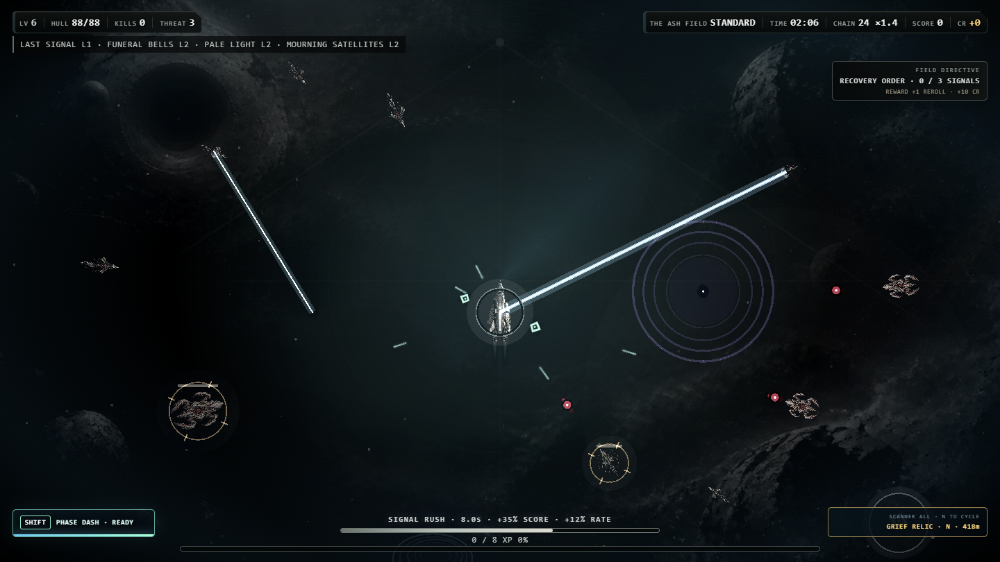

# ORBIT//04

[](https://github.com/waldmare/Orbit-04/actions/workflows/ci.yml)


ORBIT//04 is a single-player, top-down survival game about the last human-crewed vessel crossing a universe occupied by an alien organism. Weapons fire automatically while the player controls movement, positioning, and a short-range dash. A standard run lasts 12 minutes and ends with a confrontation against the Conqueror.

Current version: `0.85.0`

## Runtime overview

| Component | Implementation |
|---|---|
| Rendering | Phaser 3.90, WebGL with Canvas fallback |
| Internal resolution | 1440 × 810 |
| Desktop host | Electron 43 |
| Game logic | JavaScript running locally in the renderer process |
| Save data | Browser `localStorage` with automatic backup, manual export, and import |
| Automated checks | Node.js tests and Windows packaging on GitHub Actions |

The supported runtime is the top-down Phaser implementation loaded by `index.html`. The repository also contains an inactive third-person prototype; it is not imported by the current game.

## Implemented game systems

- 10 configurations of the single ORBIT//04 ark, each with individual statistics, a starting weapon, and a trait
- 11 automatic weapon systems rethemed around grief, survival instinct, memory, and absence
- concise level-up cards that expose immediate impact and one nearest evolution or synergy without presenting the full build graph at once
- 3 difficulty levels, 4 sectors, and 4 optional run contracts
- boss encounters at approximately 3:30, 7:30, and 12:00
- optional Ascension mode after completing the base run
- persistent credits, research upgrades, frame mastery, operations, achievements, and Codex data
- projectile grazing, kill chains, Signal Rush, Overdrive, caches, anomalies, and hostile conversion
- continuous directional travel with camera-safe world scrolling and active-encounter preservation
- deterministic conquered-universe generation beyond the starting view, including ash fields, wreckage, alien formations, and void sites
- six exploration signals: repair, combat amplification, salvage, archive fragments, risk/reward relics, and hostile jammers
- 18 persistent field notes with original, clearly labeled thematic echoes after Bernhard, Hamsun, Harry Haller in Hesse's *Steppenwolf*, Faulkner, Lem's *Solaris*, and Dostoevsky; none are presented as verbatim quotations
- a persistent, pausing Archive Reader with manual dismissal and deferred data rewards
- tiered reward ribbons for chains, Signal Rush, Overdrive, captured signals, and boss defeats
- an off-screen priority compass for bosses, Echo Hunters, and timed signal targets
- level-end pickup convergence, boss-clear salvage sweeps, and correctly queued multi-level rewards
- rerolls protected against returning an identical draw, with one upgrade card optionally pinned through the reroll
- selectable automatic targeting priorities for nearest, damaged, or elite hostiles
- a low-noise combat tracker for the build's nearest weapon evolution
- an in-run signal scanner that filters procedural discoveries by support, archive, or risk category
- a timestamped install log in Run Intel plus last-install and scanner summaries on pause
- configurable focus-loss pausing to protect active runs during task switching
- one concise Field Directive per run, rotating between exploration, travel, and attrition objectives with existing-system rewards
- live Run Intel for weapon contribution, modules, links, doctrines, protocols, artifacts, and mission conditions
- keyboard, mouse, and gamepad movement
- licensed sample playback with automatic context recovery, verified-playback status, mute warnings, and an in-game output check
- local save export, import, and reset controls

Detailed balance targets are documented in [BALANCE.md](BALANCE.md). Historical changes are recorded in [CHANGELOG.md](CHANGELOG.md).

## Rendering implementation

The Phaser scene loads the active backgrounds, ship sprites, and audio files from local paths. `visual-engine.js` manages retained object pools for ships, projectiles, pickups, particles, orbiting weapons, and damage text. Energy beams, arcs, rifts, telegraphs, and additive lighting use separate graphics layers.

The renderer includes:

- a technological player vessel contrasted with four transparent organic creature plates covering six enemy behaviors and the Conqueror boss
- a dedicated last-human ark sprite with a visible life-support core, asymmetric repair detail, responsive engines, preserved aspect ratio, and configuration-neutral hull materials
- aspect-ratio-preserving sprite scaling
- matte-free ship textures selected for the active camera scale
- frame-rate-independent position and rotation smoothing for player, hostile, and allied ships
- organic breathing, undulation, and asymmetric locomotion for alien bodies instead of spacecraft engine plumes
- thrust-responsive engine plumes, turning bank, dash afterimages, spawn easing, hit recoil, and multi-stage destruction effects
- animated pickups, exploration signals, orbiting systems, projectile streaks, and depth landmarks
- damped impact shake and background parallax instead of per-frame random jitter
- artifact-free vector glow, shields, elite markers, and telegraphs drawn in a dedicated additive pass
- configurable particles, background detail, contrast, and graphics quality
- two generated ashen environment plates, reused across four runtime states with restrained eclipse, rift, and dying-supernova animation
- a vector rendering fallback when the retained sprite engine is unavailable

## Runtime screenshot



This 1440 × 810 image was captured from the active 0.85.0 Electron/WebGL build. It shows the Last Ark player vessel, alien organism silhouettes, current combat effects, world-space HUD, and ashen environment as rendered during gameplay. The versioned filename prevents repository front-page image caches from presenting an older build.

## Audio implementation

Gameplay sound effects use selected files from Kenney's Sci-Fi Sounds package. Music uses three licensed dark-ambient tracks assigned to exploration, combat, and boss states. The runtime crossfades between those states, limits repetitive combat voices, gives major rewards priority, and briefly ducks music around important cues. Music and sound-effect volume remain independently adjustable.

License and source information is listed in [THIRD_PARTY.md](THIRD_PARTY.md).

## Display and accessibility settings

The settings screen provides:

- player and enemy health display modes
- numeric or percentage XP display
- critical-only, all, or disabled damage numbers
- optional attack telegraphs and pilot hints
- `HOLD`, `FOLLOW`, and disabled mouse steering modes
- nearest, low-hull, and elites-first automatic targeting priorities
- optional automatic pause when the game window loses focus
- screen shake and flash toggles
- full and reduced motion modes
- three interface scales
- particle, graphics, glow, background, and contrast controls
- High, Balanced, and Cinematic effect-clarity modes with hostile projectile outlining and priority telegraphs
- three dynamic-range profiles with independent music and sound-effect volume
- curated Readability, Cinematic, Performance, and Defaults profiles with individually editable controls

## Requirements

- Node.js 22 or 24 LTS (Node 22 is used by CI)
- npm
- Windows 10 or 11, 64-bit, for the release package

## Install and run

### Windows launcher

Double-click `START_ORBIT.cmd`. The launcher installs missing dependencies and starts Electron.

### Windows terminal

```bat
npm.cmd install
npm.cmd start
```

Using `npm.cmd` avoids the PowerShell `npm.ps1` execution-policy restriction without changing the system execution policy.

### macOS or Linux terminal

```bash
npm install
npm start
```

The install step runs `postinstall`, which copies the pinned Phaser runtime to `vendor/phaser.min.js`. Opening `index.html` directly from the filesystem is not the supported launch path.

## Controls

| Input | Action |
|---|---|
| `WASD` or arrow keys | Move |
| Hold left mouse button | Steer toward the cursor in `HOLD` mode |
| Mouse position | Steer toward the cursor in `FOLLOW` mode |
| Left stick or D-pad | Move with a gamepad |
| `Shift` | Phase Dash |
| `N` | Cycle the field scanner through all, support, archive, and risk signals |
| `P` or `Esc` | Pause or resume |
| `Tab` or `B` | Open or close Run Intel during a run |
| `M` | Toggle audio |
| `F` | Toggle fullscreen |
| `R` | Restart after a completed or failed run |

Weapons fire automatically.

## Tests

Run the complete suite:

```bat
npm.cmd test
```

Run only the asset integrity audit:

```bat
npm.cmd run test:assets
```

Capture the documented gameplay scene from the local Electron/WebGL build:

```bat
npm.cmd run screenshot
```

The capture command writes `docs/runtime-screenshot-v0.85.0.png` only after the renderer, gameplay state, HUD, and enemy scene pass runtime readiness checks.

The suite checks JavaScript syntax, core combat and progression behavior, boss timing, commercial systems, Ascension, renderer integration, runtime asset references, media file signatures, image dimensions, and the local Phaser bundle.

## Package the desktop application

```bat
npm.cmd run release:check
```

Electron Forge writes the validated Windows application to `out/ORBIT-04-win32-x64/`. Launch `ORBIT-04.exe` from that directory for the final local check. SteamPipe templates, store-capture commands, and the remaining Steamworks steps are documented in [STEAM_RELEASE.md](STEAM_RELEASE.md).

## Repository layout

```text
index.html                 Application shell and interface
game.js                    Game state, content, input, audio, and Phaser setup
visual-engine.js           Retained sprite pools and rendering layers
styles.css                 Interface and display settings
desktop/main.cjs           Electron main process
assets/                    Runtime images and audio
tests/                     Gameplay, renderer, and asset checks
tools/                     Asset build and Phaser vendoring scripts
.github/workflows/ci.yml   GitHub Actions test workflow
```

## Contributing

See [CONTRIBUTING.md](CONTRIBUTING.md) for setup, testing, asset licensing, and pull request requirements. Visual changes must use screenshots captured from the running game. Concept art and mockups must be labeled explicitly.

## Release status

Version 0.85.0 adds a focused Field Directive layer that gives each run one secondary route through existing exploration and combat systems without introducing another currency or menu. The repository can generate and validate the offline desktop package and real gameplay captures. A public Steam release still requires external playtesting, minimum-hardware performance validation, a Steamworks App ID and depot, final store capsules, Steam client installation testing, and Valve approval.

## License

The project source is privately hosted and proprietary. See [LICENSE.md](LICENSE.md). Third-party software and media retain their respective licenses as documented in [THIRD_PARTY.md](THIRD_PARTY.md).
